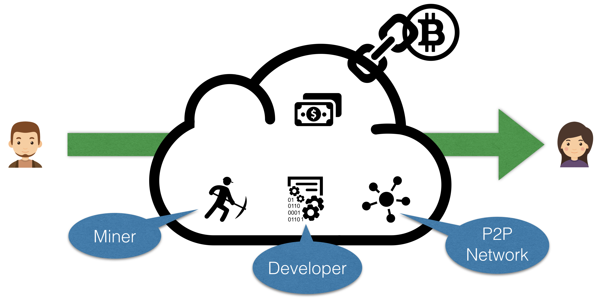

When moving to a decentralized system such as Bitcoin, the central entity (i.e. the bank) is removed and replaced by a new set of entities. In Bitcoin (or commonly referred to as Proof of Work based blockchains such as Ethereum), there are for example the Miners, Developer and the underlying P2P.


 In a centralized system, only the bank has to be aware of the transaction. In a decentralized payment system, who needs to be aware of the transactions, to validate new transactions?
 Only the receiver of a payment.
 Every validator (i.e., miner).
 Only one validator.


