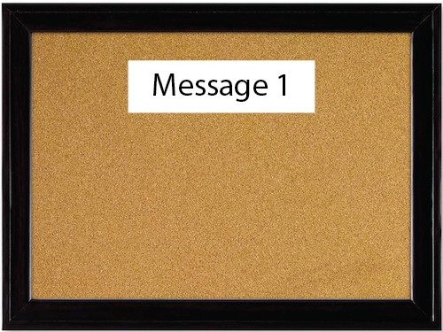
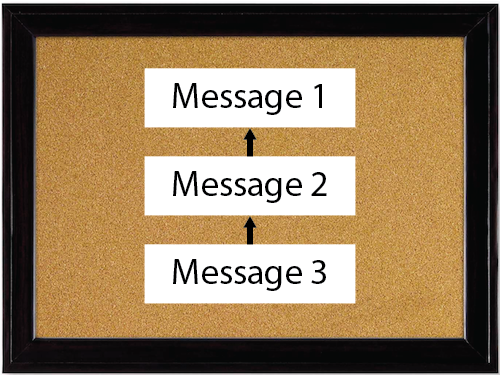

In it's simplelest form, a blockchain can be considered to be a bulletin board (credits to Ari Juels).

Anybody can post messages on this bulletin board by creating and sending a message.

Once a message is posted, it has to the reference the previous message.

The first _property_ of blockchains that we observe is:

__1. Messages are fully ordered.__

This means that messages have en exact order, and that the order of the messages is important. Note that a message is equivalent to a transaction.