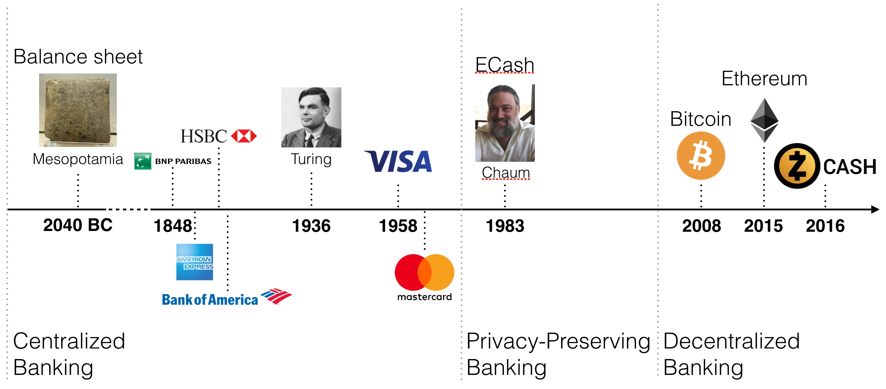

Looking back many years, the first balance sheet in history was created in Mesopotamia in the year 2040 BC. A balance sheet specifies for each individual their respective balance they possess at e.g., a bank. As such, this balance sheet represents the first instance of centralized banking. Banking literally flurished into a profitable business and many big corporations allow customers worldwide to open bank accounts (note that apparently still 39% of the world population [has no bank account](https://letstalkpayments.com/39-of-the-worlds-population-does-not-have-a-bank-account/)).

With the invention of the Turing machine in 1936, and the invention of the Internet the banking business continued to flurish. David Chaum invented in 1983 ECash, the first privacy-preserving banking system, which still remained centralized.

Only with the invention of Bitcoin by Satoshi Nakamoto in 2008, we have experienced the first instance of decentralized banking in history. To realize the importance of this change from a centralized to a decentralized system, let's consider the following example:

Bob transfers here a certain monetary amount to Alice through a centralized bank. The bank thus:

* is aware of Bob's and Alice's identity
* is aware of the transfer amount and timing
* can authorize or deny the transfer
* could be interrogated by state agencies

It is important to understand, that only the bank needs to be aware of Bob's transaction to verify it's validity.

