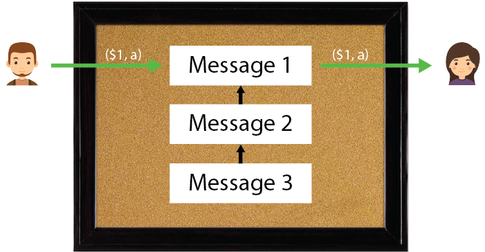

# Ownership Transfer

As we have seen on the previous bulletin board, messages are strictly ordered on the bulletin board. Having a trusted order is helpful when designing protocols that require trust in the order of events, such as a digital currency.

Let's assume we have a digital currency where every coin represents 1 US dollar. Each $1 coin has moreover a unique identification number. Let's further assume that Bob owns one $1 with id *a*, i.e. he owns ($1,*a*).

If Bob wants to transfer the ownership of ($1,*a*) to Alice, Bob would need to create a message where he signs that he's willing to transfer ($1,*a*) to Alice. Once this message is written to the bulletin board, Bob will not be able to spend ($1,*a*) anymore, because ($1,*a*) now belongs to Alice (as recorded by the bulletin board). We illustrate this concept in the following Figure.

Here Bob transfers ($1,*a*) to Alice in message 1. Message 2 appears *after* message 1, and Bob wouldn't be able to spend ($1,*a*) again in message 2 (or any other subsequent message, unless Alice transfers the ownership back to Bob).


 Under which conditions would Bob be eligible to spend ($1,*a*) again?
 If Bob buys sufficient coins to have a high stake.
 If Alice transfers the ownership of (1$,a) to Bob.
 Note that if the message board allows for message modifications, then Bob could modify message 1 and void the transfer of (1$,a) to Alice.

